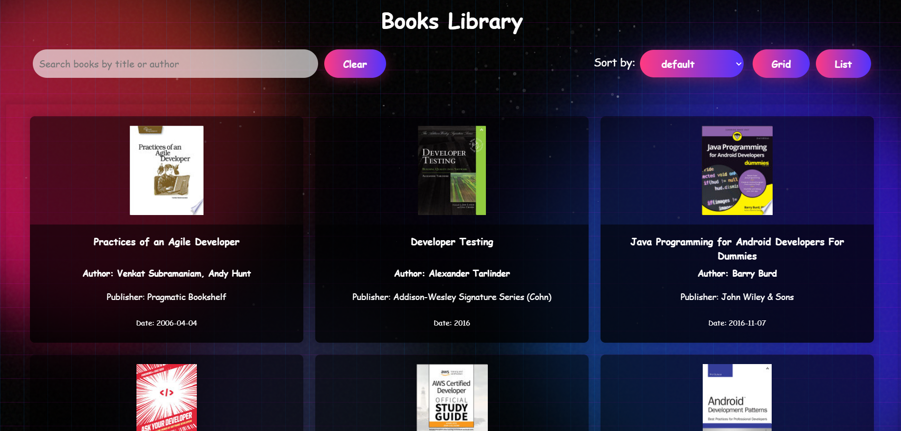

# 📚 Books Library  

A dynamic **Books Library** web application that fetches book data from **FreeAPI.app** and displays it in a **user-friendly interface**. It allows users to **search, sort, toggle views (list/grid), and paginate through book results**.  

## Live Demo  
[View the Deployed App](https://books-libraryy.netlify.app/)  

## ✨ Features  
✔ **Fetch & Display Books Dynamically** from API  
✔ **Grid/List View Toggle** for flexible browsing  
✔ **Book Details Displayed:**  
   - Title, Author, Publisher, Published Date, Thumbnail
  
✔ **Search Functionality** to filter books by **Title or Author**  
✔ **Sorting Feature**:
   - **By Published Date**  
   - **Alphabetical Order (A-Z)**
   - **Alphabetical Order (Z-A)**
   
✔ **Pagination** to load more books dynamically  
✔ **Click on a Book** to open more details in a new tab  

## 📸 Screenshots  

### 🖥 Desktop View  
  

### 📱 Mobile View  

 

## 🛠 Tech Stack  
- **Frontend:** HTML, CSS, JavaScript  
- **API:** FreeAPI.app (Public Books API)  
- **Deployment:** Vercel / Netlify  

## 📖 Usage  
1. **Open the App** (see Live Demo above).  
2. **Browse books** displayed in a **Grid or List format**.  
3. **Use the Search Bar** to find books by title or author.  
4. **Sort books** alphabetically or by **published date**.  
5. **Scroll down for Pagination** to load more books dynamically.  
6. **Click "View More"** to open detailed book info in a new tab.  

## 🔗 API Used  
**Endpoint:**  https://api.freeapi.app/api/v1/public/books
