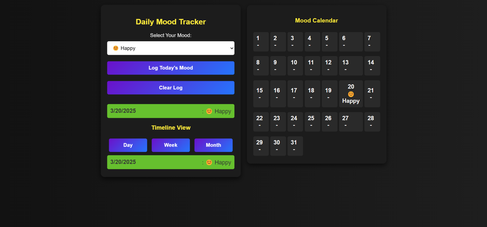

# Daily Mood Tracker  

A simple and interactive web application that allows users to log their daily moods and track emotional trends over time.

## Live Demo  
[View the Deployed App](https://daily-emotion-tracker.netlify.app/) 

## Features  
✔️ Log your mood daily with emoji-based selection  
✔️ View past moods in a timeline (Day/Week/Month views)  
✔️ Interactive calendar view to track mood trends  
✔️ Beautiful dark theme with smooth UI transitions  
✔️ Fully responsive design for desktop and mobile  

## Screenshot  

 

## Tech Stack  
- **Frontend:** HTML, CSS, JavaScript  
- **Storage:** LocalStorage  

## Usage  
1. Select your mood from the dropdown.  
2. Click "Log Today's Mood" to save it.  
3. View past moods in the **Timeline** section.  
4. Track your moods in the **Calendar View**.  
5. Click "Clear Log" to reset data.  
